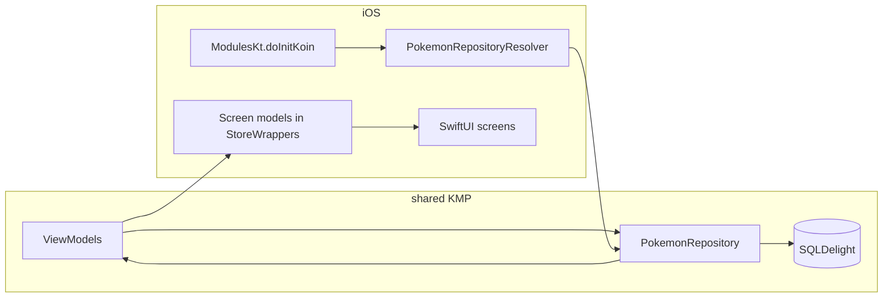

# iOS app — Pokédex (SwiftUI + Kotlin Multiplatform)

SwiftUI client for the repo’s **shared** Kotlin Multiplatform module: **API calls, pagination, SQLDelight favorites, and ViewModels** live in Kotlin; the iOS app **bridges** `StateFlow` / `Flow` into SwiftUI and handles layout, navigation, and visuals.

**Monorepo:** [`../README.md`](../README.md)
**CI:** [`.github/workflows/ios-ci.yml`](../.github/workflows/ios-ci.yml) (job name **iOS CI**)

---

## Contents

- [What you get](#what-you-get)
- [Stack](#stack)
- [Prerequisites and quick start](#prerequisites-and-quick-start)
- [Repository layout](#repository-layout-ios)
- [Architecture](#architecture)
- [Component reference](#component-reference)
- [Shared Kotlin module (summary)](#shared-kotlin-module-summary)
- [Build & run](#build--run)
- [Tests](#tests)
- [GitHub Actions CI](#github-actions-ci)
- [Troubleshooting](#troubleshooting)

---

## What you get

| Feature       | Behavior                                                                                         |
|---------------|--------------------------------------------------------------------------------------------------|
| **Pokédex**   | Paginated list (load more at scroll end), search by name, **list ↔ grid** toggle.                |
| **Detail**    | Types, stats, abilities, height/weight; **favorite** toggle persisted in SQLite.                 |
| **Favorites** | Live list from the local DB; same detail screen as Pokédex.                                      |

**Navigation:** Root **`TabView`** (Pokédex \| Favorites), each tab in **`NavigationStack`**; detail via **`navigationDestination`** keyed by Pokémon **name**.

---

## Stack

| Layer                  | Technology                                                                                      |
|------------------------|-------------------------------------------------------------------------------------------------|
| **UI**                 | SwiftUI                                                                                         |
| **Shared logic**       | KMP module **shared** → **shared.xcframework** via CocoaPods                                    |
| **DI**                 | **Koin** (`ModulesKt.doInitKoin` from Swift)                                                    |
| **DB (iOS)**           | **SQLDelight** native driver (`DatabaseDriverFactory` in `shared`)                              |
| **Coroutines ↔ Swift** | **KMPNativeCoroutines** (`KMPNativeCoroutinesCore`, `KMPNativeCoroutinesAsync` in `Podfile`)    |
| **Dependencies**       | **CocoaPods** (`Podfile`, `shared/shared.podspec`)                                              |

**Minimum iOS:** **16.0** (`Podfile`, `shared/shared.podspec`). Match your Xcode **deployment target** to that (avoid an arbitrary higher project-only target).

---

## Prerequisites and quick start

### Prerequisites

| Requirement         | Notes                                                                                           |
|---------------------|-------------------------------------------------------------------------------------------------|
| **macOS**           | Current Xcode (recent iOS SDK).                                                                 |
| **CocoaPods**       | [`cocoapods.org`](https://cocoapods.org/) — see `Podfile`.                                        |
| **JDK 17 + Gradle** | At **repository root** — builds **shared** XCFramework consumed by the `shared` pod.            |

### Quick start

From the **repository root**:

1. **Pods + workspace:** `cd iosApp && pod install && open iosApp.xcworkspace`
2. In Xcode, select the **iosApp** scheme → run on a **simulator** or device.

Always open **iosApp.xcworkspace** (not the `.xcodeproj` alone) so **Pods** and **shared** resolve.

Optional: build the framework first — `./gradlew :shared:assembleSharedDebugXCFramework` (see [Build & run](#build--run)).

---

## Repository layout (iOS)

```
iosApp/
├── Podfile                    # CocoaPods: local `shared` pod + KMP Native Coroutines
├── iosApp.xcworkspace         # Open this after `pod install` (not the .xcodeproj alone)
└── iosApp/                    # Swift sources (synced group in Xcode)
    ├── iosApp.swift           # @main App: Koin init, TabView, repository wiring
    ├── PokemonRepositoryResolver.swift
    ├── StoreWrappers.swift
    ├── KotlinBridge.swift
    ├── PokemonListScreen.swift
    ├── PokemonListCells.swift
    ├── PokemonDetailScreen.swift
    ├── PokemonDetailFormatting.swift
    ├── PokemonTypePalette.swift
    └── FavoritesScreen.swift
```

The **iosApp** folder is a **file-system synchronized** group: new Swift files here are picked up by the app target automatically.

---

## Architecture

**Why Kotlin on the “edges” of the app:** The assignment’s **shared** module owns domain rules, networking, and persistence so **Android and iOS stay aligned** and Swift avoids duplicating repository logic. The iOS target stays **thin**: init Koin, resolve **PokemonRepository**, wrap ViewModels, render SwiftUI.

### End-to-end data flow



1. **iosApp.swift** calls **ModulesKt.doInitKoin(...)** with **DatabaseDriverFactory()** (from `shared`) and retains **KoinApplication** via **PokemonRepositoryResolver.retainKoinApplication**.
2. **PokemonRepositoryResolver.pokemonRepository()** resolves Kotlin **PokemonRepository** from Koin (avoids linking **iosInterop** alongside **shared**).
3. **StoreWrappers** own Kotlin **ViewModels**, bridge **StateFlow** / **Flow** → **@Published**, call **onCleared()** on teardown.
4. **Screens** take **PokemonRepository** (or a screen model built with it) and forward actions to ViewModels.

---

## Component reference

### App entry — `iosApp.swift`

- **@main** **iOSApp**; **init()** runs **ModulesKt.doInitKoin** + **PokemonRepositoryResolver** callback.
- **body**: resolve **PokemonRepository**, **TabView** (Pokédex \| Favorites), each with **NavigationStack**.

### Dependency resolution — `PokemonRepositoryResolver.swift`

- Holds **Koin_coreKoinApplication** after init.
- **pokemonRepository()** returns Kotlin **PokemonRepository** from Koin.
- **iosInterop** exists for other setups (`getPokemonRepository()`). **This app uses only the `shared` pod** — do **not** link **`iosInterop`** and **`shared`** together (duplicate Kotlin/Native symbols).

### Kotlin ↔ SwiftUI state — `StoreWrappers.swift`

| Type                         | Role                                                                                              |
|------------------------------|---------------------------------------------------------------------------------------------------|
| **PokemonListScreenModel**   | **PokemonListViewModel**: state, search, grid flag, load/refresh/search, **loadMoreIfAtEnd**.     |
| **PokemonDetailScreenModel** | **PokemonDetailViewModel**: state, **retry**, **toggleFavorite**, title.                          |
| **FavoritesScreenModel**     | **FavoritesViewModel**: **favorites** from **Flow**.                                              |

Uses **FlowCollectorHelper** → **AsyncStream** → **@Published**.

### Helpers — `KotlinBridge.swift`

| Symbol                  | Purpose                                                                  |
|-------------------------|--------------------------------------------------------------------------|
| **FlowCollectorHelper** | **FlowCollector** so **Flow.collect** drives Swift async code.           |
| **PokemonList**         | Normalizes Kotlin / **NSArray** → **[Pokemon]** (e.g. favorites).        |
| **AppMotion**           | Shared **Animation** values (list vs toggle).                            |

### Screens & UI

| File                              | Role                                                                 |
|-----------------------------------|----------------------------------------------------------------------|
| **PokemonListScreen.swift**       | List/grid, loading/empty/error, search, layout toggle, navigation.   |
| **PokemonListCells.swift**        | **PokemonGridCell**, **PokemonListCell**.                            |
| **PokemonDetailScreen.swift**     | Detail content, favorite, stats, types, metrics.                     |
| **PokemonDetailFormatting.swift** | Stat labels, height/weight, bars.                                    |
| **PokemonTypePalette.swift**      | Type colors — **dynamic** `UIColor`, trait-aware light/dark.         |
| **FavoritesScreen.swift**         | Empty state or list; navigation to detail.                           |

---

## Shared Kotlin module (summary)

ViewModels, models, and **initKoin** are documented in the **[root `README.md`](../README.md)**. This app uses **PokemonRepository**, **PokemonListViewModel**, **PokemonDetailViewModel**, **FavoritesViewModel** as described there.

---

## Build & run

From the **repository root**:

1. **(Optional)** Build the XCFramework:

   ```bash
   ./gradlew :shared:assembleSharedDebugXCFramework
   ```

   Release (if needed):

   ```bash
   ./gradlew :shared:assembleSharedReleaseXCFramework
   ```

2. **Install pods** and open the **workspace**:

   ```bash
   cd iosApp
   pod install
   open iosApp.xcworkspace
   ```

3. Select **iosApp** → run on simulator or device.

Use **iosApp.xcworkspace** so Xcode sees **Pods** and **shared**.

---

## Tests

- **iosAppTests**: Swift unit tests (e.g. **StoreWrappers**, **PokemonList**). Test target uses **inherit! :search_paths** in **Podfile** so tests don’t link a second Kotlin runtime.
- **MockPokemonRepository.swift**: Test double for **PokemonRepository**.

---

## GitHub Actions CI

Workflow: **[`.github/workflows/ios-ci.yml`](../.github/workflows/ios-ci.yml)** — macOS runner builds **`shared`** with Gradle, **`pod install`**, then **`xcodebuild` build + test** on **iOS Simulator** (no signing).

### One-time GitHub setup

1. Commit the workflow on the default branch (or merge a PR that adds it).
2. **Settings → Actions → General** — enable Actions (read-only is enough).
3. *(Optional)* Branch protection: require **iOS CI** on `main`.

No **secrets** required.

### Triggers

| Event                 | When                                         |
|-----------------------|----------------------------------------------|
| **Push**              | Branches **ios/** or **main**.               |
| **Pull request**      | Target **main**.                             |
| **workflow_dispatch** | **Actions** → **iOS CI** → **Run workflow**. |

To run on every branch, edit `on:` in the workflow file.

### Job steps

1. Checkout · 2. JDK 17 · 3. `./gradlew :shared:assembleSharedDebugXCFramework` · 4. `pod install` in **iosApp/** · 5. `xcodebuild build` · 6. `xcodebuild test` (**iosAppTests**).

<details>
<summary><strong>More CI troubleshooting (expand)</strong></summary>

- **`IPHONEOS_DEPLOYMENT_TARGET` invalid** — Match a supported iOS (e.g. **16.0**) to the runner’s Xcode.
- **`[CP-User] Build shared` / Gradle** — CI may set **`OVERRIDE_KOTLIN_BUILD_IDE_SUPPORTED=YES`**; XCFramework is built by Gradle before **`xcodebuild`**.
- **`no such module 'shared'` (simulator arch)** — Apple Silicon runners: CI may pass **`ARCHS=arm64`**, **`EXCLUDED_ARCHS[sdk=iphonesimulator*]=x86_64`** — align with your workflow.
- **`xcodebuild test` + generic simulator** — Use a **concrete destination `id=`** (as in **`run-ci-locally.sh`**), not only generic platform.

</details>

---

## Troubleshooting

| Issue                         | Try                                                                                        |
|-------------------------------|--------------------------------------------------------------------------------------------|
| **Pods / `shared` not found** | `pod install` from **iosApp/**; open **.xcworkspace**.                                     |
| **Stale framework**           | From root: `./gradlew :shared:assembleSharedDebugXCFramework`, then clean build in Xcode.  |
| **Duplicate Kotlin symbols**  | Don’t add **iosInterop** as another pod with **shared**.                                   |

---

