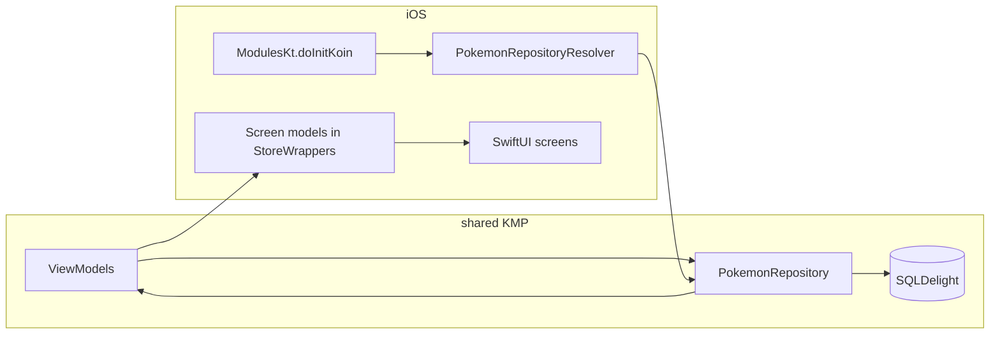

# iOS app — Pokédex (SwiftUI + Kotlin Multiplatform)

A **SwiftUI** client for the shared **Kotlin Multiplatform** (`shared`) module. The iOS target is intentionally thin: **networking, pagination, SQLite favorites, and ViewModels** live in Kotlin; SwiftUI observes that state through small bridges and presents list, detail, and favorites flows.

---

## What you get

|    Feature    |                                          Behavior                                                  |
|---------------|----------------------------------------------------------------------------------------------------|
|  **Pokédex**  |Paginated list (load more at scroll end), search by name, **list ↔ grid** layout toggle.            |
|   **Detail**  |Full Pokémon info (types, stats, abilities, height/weight), **favorite** toggle persisted in SQLite.|
| **Favorites** | Live list of favorited Pokémon from the local DB; tap through to the same detail screen.           |

Navigation: root **`TabView`** (Pokédex | Favorites), each tab wrapped in **`NavigationStack`**; detail is pushed via **`navigationDestination`** using the Pokémon **name** as the navigation value.

---

## Stack

| Layer | Technology |
|--------------------|-----------------|
| UI                 | SwiftUI |
| Shared logic       | Kotlin Multiplatform module **`shared`** (compiled to **`shared.xcframework`** via CocoaPods) |
| DI                 | **Koin** (initialized from Swift with `ModulesKt.doInitKoin`)                                 |
| DB (iOS)           | **SQLDelight** native driver (wired in `shared` / `DatabaseDriverFactory`)                    |
| Coroutines ↔ Swift | **KMPNativeCoroutines**(`KMPNativeCoroutinesCore`, `KMPNativeCoroutinesAsync`) — listed in                        `Podfile` for Flow/async interop                                                              |
| Dependency manager | **CocoaPods** (`Podfile` + `shared/shared.podspec`)                                           |

**Minimum iOS:** **16.0** (`Podfile` and `shared/shared.podspec`). Use an Xcode whose **iOS deployment target** matches (avoid mixing a much higher project-only target with no need).

---

## Repository layout (iOS)

```
iosApp/
├── Podfile                    # CocoaPods: local `shared` pod + KMP Native Coroutines
├── iosApp.xcworkspace         # Open this after `pod install` (not the .xcodeproj alone)
└── iosApp/                    # Swift sources (synced group in Xcode)
    ├── iosApp.swift           # @main App: Koin init, TabView, repository wiring
    ├── PokemonRepositoryResolver.swift
    ├── StoreWrappers.swift
    ├── KotlinBridge.swift
    ├── PokemonListScreen.swift
    ├── PokemonListCells.swift
    ├── PokemonDetailScreen.swift
    ├── PokemonDetailFormatting.swift
    ├── PokemonTypePalette.swift
    └── FavoritesScreen.swift
```

The **`iosApp`** folder is a **file-system synchronized** group in Xcode: new Swift files here are picked up by the app target automatically.

---

## End-to-end data flow



1. **`iosApp.swift`** calls **`ModulesKt.doInitKoin(...)`** with a **`DatabaseDriverFactory()`** (from `shared`) and retains the **`KoinApplication`** via **`PokemonRepositoryResolver.retainKoinApplication`**.
2. **`PokemonRepositoryResolver.pokemonRepository()`** resolves the Kotlin **`PokemonRepository`** from Koin (Swift-side lookup by type; avoids linking a second framework such as `iosInterop` alongside `shared`).
3. **`StoreWrappers`** types own the Kotlin **ViewModels**, collect **`StateFlow`** / **`Flow`** into **`@Published`** properties, and call **`onCleared()`** on teardown.
4. **Screens** take a **`PokemonRepository`** (or use a screen model that was created with it) and render UI; user actions call into the screen models / ViewModels.

---

## Component reference

### App entry — `iosApp.swift`

- Declares **`@main`** **`iOSApp`**.
- **`init()`**: runs **`ModulesKt.doInitKoin`** with **`DatabaseDriverFactory()`**, **`enableNetworkLogs`**, and a callback that stores the Koin app in **`PokemonRepositoryResolver`**.
- **`body`**: resolves **`PokemonRepository`** once, builds **`TabView`** with **Pokédex** and **Favorites** tabs, each with **`NavigationStack`** and the shared repository.

### Dependency resolution — `PokemonRepositoryResolver.swift`

- Holds a static reference to **`Koin_coreKoinApplication`** after init.
- **`pokemonRepository()`** returns the Kotlin **`PokemonRepository`** protocol type exported from **`shared`**, resolved from Koin’s registry (by **`PokemonRepository`**’s qualified name).
- **Note:** The repo also contains an **`iosInterop`** Gradle module with **`getPokemonRepository()`** for *single-framework* setups. The iOS app uses **only** the **`shared`** CocoaPod; do **not** link **`iosInterop`** and **`shared`** in the same app (duplicate Kotlin/Native symbols).

### Kotlin ↔ SwiftUI state — `StoreWrappers.swift`

|         Type          |                                        Role                                         |
|-----------------------|-------------------------------------------------------------------------------------|
| **PokemonListScreenModel**   | Wraps **PokemonListViewModel**: **state**, **searchText**, **isGrid**,                                            **loadNextPage**, **refresh**, **search**, **toggleGridLayout**,                                                  **loadMoreIfAtEnd**.                                                         |
| **PokemonDetailScreenModel** | Wraps **PokemonDetailViewModel**: **state**, **retry**, **toggleFavorite**,                                       **navigationTitle**.                                                         |
| **FavoritesScreenModel**     | Wraps **FavoritesViewModel**: **favorites** array from **Flow**.             |

Each model uses **`FlowCollectorHelper`** (see below) to bridge Kotlin flows into Swift **`AsyncStream`** → **`@Published`** updates.

### Helpers — `KotlinBridge.swift`

| Symbol | Purpose |
|--------|---------|
| **`FlowCollectorHelper`** | Implements Kotlin’s **`FlowCollector`** so **`Flow.collect`** can drive Swift async code. |
| **`PokemonList`** | Normalizes Kotlin/`NSArray` list payloads into **`[Pokemon]`** (used for favorites decoding). |
| **`AppMotion`** | Shared **`Animation`** values (list/spring vs toggle/ease) for consistent motion. |

### Screens & UI

| File | Role |
|------|------|
| **`PokemonListScreen.swift`** | List / grid / loading / empty / error; search bar; toolbar layout toggle; navigation to detail. |
| **`PokemonListCells.swift`** | **`PokemonGridCell`**, **`PokemonListCell`** — reusable row/grid cells. |
| **`PokemonDetailScreen.swift`** | Detail scroll content, favorite button, stats, types, metrics. |
| **`PokemonDetailFormatting.swift`** | Pure helpers: Kotlin list/stat bridging, stat labels, height/weight math, max stat for bars. |
| **`PokemonTypePalette.swift`** | Type chip **colors** with light/dark **dynamic** `UIColor` (trait-aware). |
| **`FavoritesScreen.swift`** | Empty state vs **`List`** of favorites; navigation to detail. |

---

## Shared Kotlin module (summary)

Detailed API tables (ViewModels, models, **`initKoin`**) live in the **[root `README.md`](../README.md)**. The iOS app depends on the same **`PokemonRepository`**, **`PokemonListViewModel`**, **`PokemonDetailViewModel`**, and **`FavoritesViewModel`** described there.

---

## Requirements

- **Xcode** (recent iOS SDK).
- **[CocoaPods](https://cocoapods.org/)** — see `Podfile`.
- **JDK 17** and **Gradle** at the **repository root** — used to build **`shared`** into an **XCFramework** consumed by the `shared` pod (`shared/shared.podspec` runs Gradle on `pod install` / build phases as configured).

---

## Build & run

From the **repository root**:

1. **(Optional)** Build the shared XCFramework explicitly:

   ```bash
   ./gradlew :shared:assembleSharedDebugXCFramework
   ```

   Release slice (if needed):

   ```bash
   ./gradlew :shared:assembleSharedReleaseXCFramework
   ```

2. **Install pods** and open the **workspace**:

   ```bash
   cd iosApp
   pod install
   open iosApp.xcworkspace
   ```

3. Select the **`iosApp`** scheme and run on a **simulator** or **device**.

Always use **`iosApp.xcworkspace`** so Xcode sees the **`Pods`** project and the **`shared`** pod.

---

## Tests

- **`iosAppTests`** — Swift unit tests (e.g. **`StoreWrappers`**, **`PokemonList`** bridging). The nested **`iosAppTests`** target uses **`inherit! :search_paths`** in the **`Podfile`** so the test bundle does **not** link a second Kotlin runtime (Kotlin comes only from the host app).
- **`MockPokemonRepository.swift`** — test double implementing **`PokemonRepository`** where needed.

**Xcode:** **⌘U** to test.

**CLI** (replace simulator name as needed):

```bash
cd iosApp
xcodebuild test -workspace iosApp.xcworkspace -scheme iosApp -sdk iphonesimulator \
  -destination 'platform=iOS Simulator,name=iPhone 16'
```

---

## GitHub Actions CI

Workflow file: **[`.github/workflows/ios-ci.yml`](../.github/workflows/ios-ci.yml)**.

It runs on **macOS**, builds the **`shared`** XCFramework with Gradle, installs CocoaPods dependencies, then **builds and tests** the **`iosApp`** scheme against the **iOS Simulator** (no code signing).

### One-time repository setup (GitHub)

1. **Push the workflow file** — Commit `.github/workflows/ios-ci.yml` on your default branch (or merge a PR that adds it).
2. **Enable Actions** — In the GitHub repo: **Settings → Actions → General** → allow **Actions** (read and write is optional; read-only is enough for this workflow).
3. **Branch protection (optional)** — **Settings → Rules → Rulesets** (or branch protection): require the **“iOS CI”** check to pass before merging to `main`, if you want.

No **secrets** are required for this workflow (public clone, Gradle, CocoaPods, Xcode on the runner).

### What triggers CI

| Event | When it runs (see the workflow file for exact `on:`) |
|--------|------------------------------------------------------|
| **Push** | To **`ios/**`** or **`main`**. |
| **Pull request** | Targeting **`main`**. |
| **workflow_dispatch** | Manual run: **Actions** tab → **iOS CI** → **Run workflow**. |

To run CI on **every push** or **all PRs**, edit **`on:`** in `.github/workflows/ios-ci.yml` (for example add `main` to `push.branches` or widen `pull_request`).

### What the job does

1. **Checkout** the repo.
2. **JDK 17** (Temurin) for Gradle.
3. **`./gradlew :shared:assembleSharedDebugXCFramework`** — produces the framework the **`shared`** pod expects.
4. **`pod install`** in **`iosApp/`** — generates **`Pods/`** and **`iosApp.xcworkspace`**.
5. **`xcodebuild build`** — simulator build, signing disabled for CI.
6. **`xcodebuild test`** — unit tests (**`iosAppTests`**).

### If CI fails on GitHub but works locally

- **`pod: command not found`** — The workflow should install CocoaPods; if you fork an older workflow, add an **Install CocoaPods** step (`gem` or `brew`).
- **`Permission denied` on `./gradlew`** — Ensure **`gradlew`** is committed as executable (`chmod +x gradlew` and commit).
- **Simulator / Xcode mismatch** — Runners ship a current Xcode; `-destination 'generic/platform=iOS Simulator'` avoids naming a specific device. For a fixed OS version, set **`DEVELOPER_DIR`** or use **`xcode-select`** in the workflow.
- **Branch filter** — If CI does not run on your branch, add it under **`on.push.branches`** in the workflow.

---

## Troubleshooting

| Issue | What to try |
|-------|-------------|
| **Pods / `shared` not found** | Run **`pod install`** from **`iosApp/`**; open **`.xcworkspace`**. |
| **Gradle / framework out of date** | From repo root: **`./gradlew :shared:assembleSharedDebugXCFramework`**, then clean build in Xcode. |
| **Duplicate Kotlin symbols** | Do not add **`iosInterop`** as another pod while using **`shared`**. |
| **Tests crash with Kotlin** | Ensure test targets use **`inherit! :search_paths`** pattern for Kotlin, as in this **`Podfile`**. |

---

## Related docs

- **[`../README.md`](../README.md)** — monorepo overview, **`shared`** ViewModels and models, Gradle commands.
- **[`../androidApp/README.md`](../androidApp/README.md)** — Android app (parallel consumer of **`shared`**).
